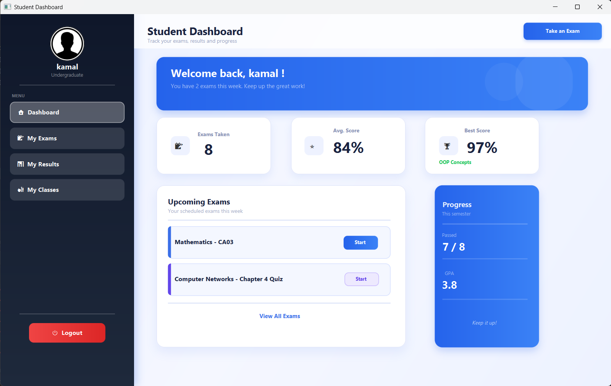
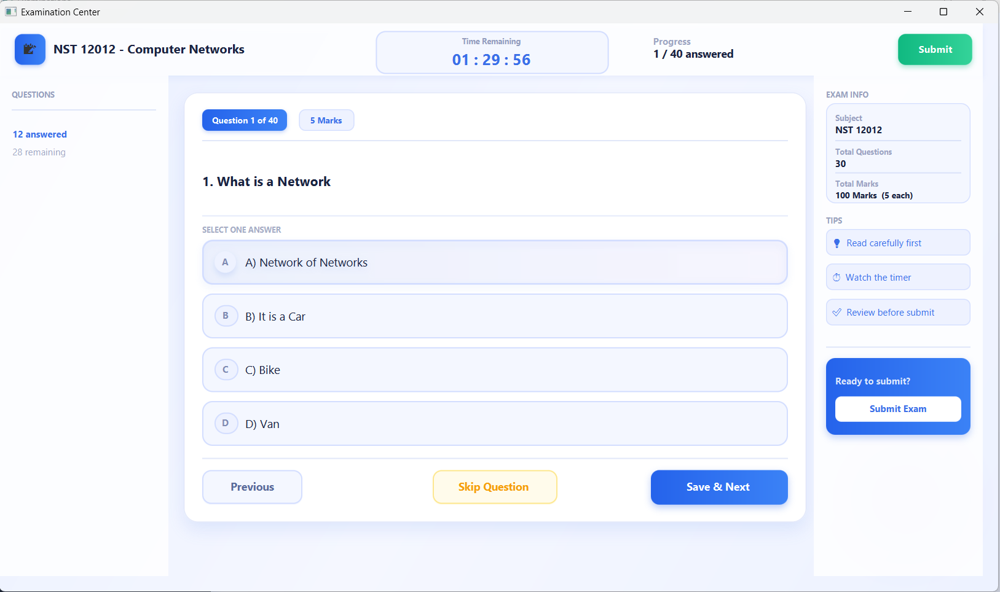

# 🎓 Online Examination System (JavaFX)

A comprehensive, desktop-based Student Management and Online Examination System developed using **JavaFX** and **MySQL**. This application allows educational institutes to manage exams, questions, and students efficiently while providing a secure environment for students to take exams with real-time timers.


---

> ⚠️ **Project Status:** This is a **Prototype / MVP (Minimum Viable Product)**. The core functionalities (Login, Exam Timer, Question Loading, Database Connection) are fully functional. Some secondary features (Results analysis, Advanced Reports) are currently in the **UI-only phase** and are planned for future updates.


## 🚀 Features

### 👨‍🎓 Student Portal
* **Secure Login:** Role-based authentication for students.
* **Dashboard:** View available exams and profile details.
* **Real-time Exam Interface:**
    * ⏳ Countdown timer (auto-submit when time is up).
    * 🔄 Dynamic loading of questions (MCQ) from the database.
    * 💾 "Save & Next" functionality to record answers.
    * ⏩ Easy navigation between questions.

### 👩‍🏫 Teacher/Admin Portal
* **Exam Management:** Create and schedule new exams.
* **Question Bank:** Add multiple-choice questions (MCQs) to specific exams.
* **Results:** View student performance and marks.

---

## 🛠️ Technologies Used

* **Programming Language:** Java (JDK 21)
* **UI Framework:** JavaFX
* **Database:** MySQL 8.0
* **Containerization:** Docker & Docker Compose
* **IDE:** IntelliJ IDEA
* **Build Tool:** Maven

---

## ⚙️ Setup & Installation

Follow these steps to set up the project locally.

### Prerequisites
* [Java JDK 21](https://www.oracle.com/java/technologies/downloads/) installed.
* [Docker Desktop](https://www.docker.com/products/docker-desktop/) installed and running.
* [IntelliJ IDEA](https://www.jetbrains.com/idea/) (Recommended).

### 1. Clone the Repository
Open your terminal and run:
```bash
git clone [https://github.com/ChalanaDilshan/Online-Exam-System-JavaFX.git](https://github.com/ChalanaDilshan/Online-Exam-System-JavaFX.git)
cd Online-Exam-System-JavaFX

```

### 2. Set up the Database (Docker)

This project uses Docker to run the MySQL database without needing a local MySQL installation.

1. Make sure **Docker Desktop** is open and running.
2. Open your terminal in the project folder and run:

```bash
# Start the database container
docker-compose up -d

```

*This command will pull the MySQL image and start the `oes_database` container on port `3308`.*

### 3. Initialize the Database Schema

The `init.sql` file contains the necessary table structures and initial data.
If you are running this for the first time, import the schema manually using this command:

```bash
docker exec -i oes_database mysql -u root -proot users_db < init.sql

```

### 4. Run the Application

1. Open the project in **IntelliJ IDEA**.
2. Wait for **Maven** to download all dependencies.
3. Navigate to `src/main/java/com/example/studentmanagement/`.
4. Right-click on **`HelloApplication.java`** and select **Run**.

---

## 🗄️ Database Schema

The system uses a relational MySQL database with the following key tables:

| Table Name | Description |
| --- | --- |
| **`users`** | Stores login credentials, user roles (Student/Teacher), and profile details. |
| **`exams`** | Contains exam metadata such as Subject, Duration, and Question Count. |
| **`questions`** | Stores Multiple Choice Questions (MCQs), options, and correct answers linked to specific exams. |
| **`student_answers`** | Records the answers selected by students during an exam for grading purposes. |

---


## 📸 Screenshots

| Login Screen | Student Dashboard |
| :---: | :---: |
|  |  |

| Exam Interface | Teacher Dashboard |
| :---: | :---: |
|  |  |


---

## 📄 License

This project is licensed under the **MIT License**.
